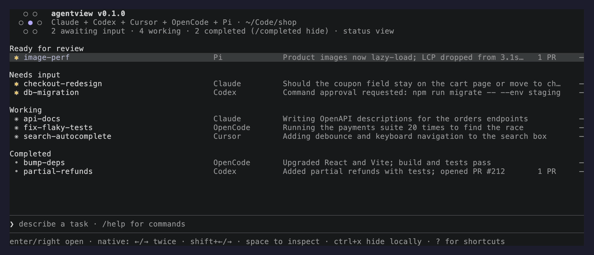

<div align="center">

<h1> agentview</h1>

**All your coding agents. One terminal.**<br>
See which one needs you. Jump in, jump back out. Works with 18 coding
harnesses and plain shell jobs.

[](docs/testing.md)
[](https://github.com/moritzWa/agentview/releases/latest)
[](LICENSE)



</div>

## Install

```console
curl -fsSL https://raw.githubusercontent.com/moritzWa/agentview/main/install.sh | bash
```

<details>
<summary>Windows PowerShell</summary>

```powershell
irm https://raw.githubusercontent.com/moritzWa/agentview/main/install.ps1 | iex
```

</details>

<details>
<summary>Build from source</summary>

```console
cargo install --locked --git https://github.com/moritzWa/agentview
```

</details>

Run `agentview`, or the shorter `av` command the installer adds. Type a task,
press `Tab` to pick a harness and `Shift+Tab` to pick a model.

## Why

Five agents means five terminal tabs, and the one waiting on you is in the tab
you aren't looking at. agentview lists every session from every harness in one
place, with the ones that need you on top. Selecting a row opens the harness's
own interface.

## Features

- **Grouped by status:** waiting for input, working, completed. The harness is
  shown on every row.
- **Jump in and back out** of a native session while its work keeps running.
- **Bring back any past session** without leaving the dashboard. `Ctrl+G`
  searches older and hidden sessions by name, harness, folder, or ID, even
  while you're typing a task, and `Enter` puts the session back in the list.
  No new terminal, `cd`, or `--resume` needed.
- **Launches stay on the dashboard** for harnesses that can run in the
  background. `Enter` opens the new row.
- **Pause sessions you're waiting on** with `Ctrl+T`. They move into a Paused
  group that stays collapsed until you press `Enter` on it. Reorder rows with
  `Option+↑` / `↓`.
- **Start in any folder** with `/cd` or `Ctrl+O` (`Cmd+O` in terminals that
  forward it, like Ghostty and kitty). Multi-line tasks and pastes
  stay one draft. A long paste shows as `[Pasted ~12 lines]` and `Ctrl+V`
  attaches a clipboard image as `[Image #1]`.
- **Move a session to another folder** with `Ctrl+M` (`Cmd+M` where the
  terminal forwards it), or **migrate it** to another harness with `/migrate`,
  both via [session-migrate](https://session-migrate.github.io/).
- **OpenCode sessions outlive the dashboard**, and Cursor chats show live state
  on every platform.
- **Fast with big histories.** Refreshes run in the background, so typing and
  arrows never wait on a harness. Where a harness's own CLI is slow to start,
  agentview reads its data directly instead: an OpenCode refresh over a 17 GB
  history takes about 0.1 s, and Cursor about 3 ms.
- **Light and dark themes** that follow the terminal and the OS. Force one with
  `--theme`.
- **`Ctrl+X` twice** stops and hides or deletes a session, no dialog.

### Refresh time by harness

agentview is fast because it skips each harness's CLI wherever it can and
reads the data itself: OpenCode's SQLite database directly instead of starting
`opencode db` for every query, and which Cursor chats are open straight from
macOS instead of running `lsof`.

| Harness | Time per refresh | How agentview reads it |
| --- | ---: | --- |
| OpenCode | ~130 ms | Its SQLite database, read-only (going through `opencode db` took ~460 ms) |
| Claude Code | ~180 ms | `claude agents --json` |
| OpenAI Codex | ~80 ms | Codex's App Server |
| Cursor | ~3 ms | Its chat files, plus macOS for which chats are open (`lsof` took ~80 ms) |
| Devin | ~6 ms | Its SQLite database, read-only |
| Pi, Antigravity, Terminal | under 1 ms | Session files and agentview's own records |

Median over 30 s of one-second refreshes on an Apple M5 Pro with a 17 GB
OpenCode history, measured with [`AGENTVIEW_PERF_LOG`](docs/cli.md#timing-log).
Harnesses are read in parallel, and none of it runs on the input thread.

## Keys

| Do this | Press |
| --- | --- |
| Move through sessions | `↑` / `↓` |
| Open the selected session | `Enter` or `→` |
| Return to agentview | `Shift+←`, or `←` twice at an empty prompt (once in Claude Code and OpenCode) |
| Bring back a past session | `Ctrl+G` or `/hidden` |
| Rename / filter | `Ctrl+R` / `Ctrl+F` |
| New line in a task | `Shift+Enter`, `Ctrl+J`, or `\` then `Enter` |
| Show every shortcut | `?` |

The [CLI and keyboard guide](docs/cli.md) covers models, login, paging, bulk
actions, non-interactive commands, and [`--yolo`](docs/cli.md#explicit-yolo-mode)
for unattended runs.

## Harnesses

agentview brings 18 local coding harnesses plus Terminal into one dashboard: [Claude Code](https://github.com/anthropics/claude-code), [OpenAI Codex](https://github.com/openai/codex), [Pi](https://pi.dev), [OpenCode](https://github.com/anomalyco/opencode), [Cursor](https://cursor.com/cli), [GitHub Copilot](https://github.com/github/copilot-cli), [Antigravity](https://developers.google.com/antigravity), [Mistral Vibe](https://github.com/mistralai/mistral-vibe), [Muse Code](https://dev.meta.ai/), [Qwen Code](https://github.com/QwenLM/qwen-code), [Kimi Code](https://github.com/MoonshotAI/kimi-cli), [Oh My Pi](https://github.com/can1357/oh-my-pi), [Grok](https://github.com/xai-org/grok-build), [Kilo Code](https://github.com/Kilo-Org/kilocode), [OpenHands](https://github.com/OpenHands/OpenHands-CLI), [Hermes Agent](https://github.com/NousResearch/hermes-agent), [MastraCode](https://github.com/mastra-ai/mastra/tree/main/mastracode), [Devin](https://github.com/CognitionAI/devin-cli), [Terminal](docs/cli.md).

<details>
<summary><strong>Compare feature support by harness</strong></summary>

| Harness | Launch | Model / shell picker | Open / resume | Inspect | Inline reply | Approval / input | Stop | Delete / archive |
| --- | :---: | :---: | :---: | :---: | :---: | :---: | :---: | :---: |
| Claude Code | ✓ | ✓ | ✓ | ✓ | — | — | ✓ | — |
| OpenAI Codex | ✓ | ✓ | ✓ | ✓ | ✓ | ✓ | ✓ | ✓ |
| Pi | ✓ | ✓ | ✓ | ✓ | ✓ | ✓ | ✓ | ✓ |
| OpenCode | ✓ | ✓ | ✓ | ✓ | ✓ | — | ✓ | — |
| Cursor | ✓ | ✓ | ✓ | ✓ | ✓ | — | ✓ | — |
| GitHub Copilot | ✓ | ✓ | ✓ | ✓ | ✓ | ✓ | ✓ | — |
| Antigravity | ✓ | ✓ | ✓ | — | — | — | ✓ | — |
| Mistral Vibe | ✓ | ✓ | ✓ | ✓ | — | — | ✓ | — |
| Muse Code | ✓ | ✓ | ✓ | ✓ | — | — | ✓ | — |
| Qwen Code | ✓ | ✓ | ✓ | ✓ | — | — | ✓ | — |
| Kimi Code | ✓ | ✓ | ✓ | ✓ | — | — | ✓ | — |
| Oh My Pi | ✓ | ✓ | ✓ | ✓ | — | — | ✓ | — |
| Grok | ✓ | ✓ | ✓ | ✓ | — | — | ✓ | — |
| Kilo Code | ✓ | ✓ | ✓ | ✓ | — | — | ✓ | — |
| OpenHands | ✓ | ✓¹ | ✓ | ✓ | — | — | ✓ | — |
| Hermes Agent | ✓² | ✓¹ | ✓² | ✓ | — | — | ✓² | — |
| MastraCode | ✓² | ✓¹ | ✓² | ✓ | — | — | ✓² | — |
| Devin | ✓ | ✓ | ✓ | ✓ | — | — | ✓ | — |
| Terminal | ✓ | ✓ | ✓ | ✓ | — | — | ✓ | ✓ |

A dash means the session still shows up, but that action stays in the
harness's own interface.

¹ Models come from saved sessions or configs; exact model IDs also work.
² Prompt automation needs a Unix terminal.

</details>

Versions, auth, and per-harness caveats are in the
[provider notes](docs/exploration/README.md).

## Docs

[Install](docs/install.md) · [CLI](docs/cli.md) ·
[Troubleshooting](docs/troubleshooting.md) ·
[Architecture](docs/architecture.md) · [Testing](docs/testing.md) ·
[Contributing](CONTRIBUTING.md) · [Security](SECURITY.md)

## License

[MIT](LICENSE). Not affiliated with any of the harnesses listed above.
